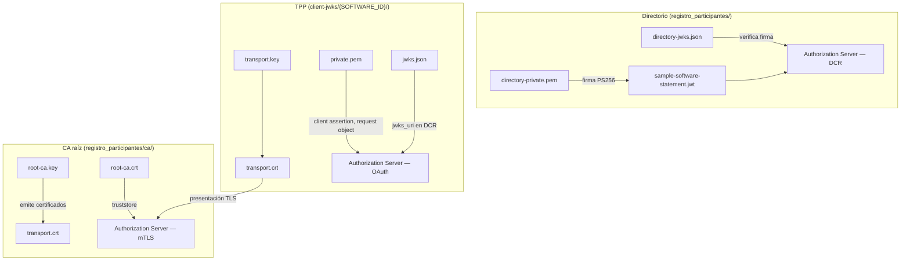

# Client Registration Policy — material criptográfico del POC

Scripts y artefactos para simular el ecosistema de **Finanzas Abiertas (CMF Chile)** en entorno local: Directorio de participantes, registro dinámico de clientes (DCR), firma JWS y certificados mTLS de transporte.

## Roles y capas de confianza

En producción intervienen tres actores con material criptográfico distinto. **No mezclar usos**: una clave JWS no firma certificados X.509, y un certificado mTLS no firma JWTs.

| Actor | Qué representa | Material | Capa |
|---|---|---|---|
| **Directorio de participantes** | Entidad que autoriza software TPP y emite el SSA | `registro_participantes/directory-*` | Aplicación (JWT / JWS) |
| **CA raíz del ecosistema POC** | Autoridad que emite certificados de transporte | `registro_participantes/ca/root-ca.*` | Transporte (TLS / X.509) |
| **TPP (cliente OAuth)** | Proveedor que consume APIs del banco | `client-jwks/{SOFTWARE_ID}/*` | Aplicación + transporte |



## Scripts

Todos se ejecutan desde `clientRegistrationPolicy/`. Leen variables de `ssa.env` (o `ssa.env.example` si no existe).

| Script | Cuándo ejecutarlo | Requisitos |
|---|---|---|
| [`scripts/generate-root-ca.sh`](scripts/generate-root-ca.sh) | **Una vez por entorno** antes de emitir certificados mTLS | `openssl` |
| [`scripts/generate-client-jwks.sh`](scripts/generate-client-jwks.sh) | **Por cada TPP nuevo** (cambia `SSA_SOFTWARE_ID` en `ssa.env`) | `openssl`, `pip install cryptography`, CA raíz existente |
| [`scripts/generate-test-ssa.sh`](scripts/generate-test-ssa.sh) | Tras definir o cambiar claims del participante en `ssa.env` | `pip install cryptography` |
| [`scripts/build-provider.sh`](scripts/build-provider.sh) | Compilar el provider Keycloak (Java) | Maven o Docker |

### Orden recomendado para un cliente nuevo

```bash
cp ssa.env.example ssa.env
# Editar ssa.env: SSA_SOFTWARE_ID, SSA_ORGANISATION_ID, SSA_SOFTWARE_JWKS_URI, etc.

./scripts/generate-root-ca.sh          # omitir si la CA ya existe
./scripts/generate-client-jwks.sh      # claves JWS + certificado mTLS del TPP
./scripts/generate-test-ssa.sh         # SSA firmado por el Directorio
```

Variable de entorno alternativa para todos los scripts:

```bash
SSA_ENV=/ruta/custom.env ./scripts/generate-client-jwks.sh
```

---

## Salidas por script

### `generate-root-ca.sh`

Crea la **autoridad certificadora raíz** del POC. Solo emite certificados X.509 de transporte; no interviene en DCR ni en firmas JWT.

| Archivo generado | Formato | ¿Quién lo usa? | Para qué sirve |
|---|---|---|---|
| `registro_participantes/ca/root-ca.crt` | X.509 (PEM) | Authorization Server, API Gateway, curl | **Truststore**: confiar en certificados de clientes emitidos por esta CA |
| `registro_participantes/ca/root-ca.key` | RSA privada (PEM) | Solo el script emisor | Firmar nuevos `transport.crt` de TPPs. **Secreto — no versionar** |
| `registro_participantes/ca/root-ca.srl` | Texto (serial) | OpenSSL internamente | Control de numeración de certificados emitidos |

**Salida en consola (stdout/stderr):**

```
registro_participantes/ca/root-ca.crt          ← ruta del certificado (stdout)
root_ca_key=registro_participantes/ca/root-ca.key
root_ca_cert=registro_participantes/ca/root-ca.crt
subject=CN=SFA POC Root CA, ...
issuer=CN=SFA POC Root CA, ...
notBefore=...
notAfter=...
```

**Regenerar** (invalida todos los `transport.crt` existentes):

```bash
FORCE=1 ./scripts/generate-root-ca.sh
```

---

### `generate-client-jwks.sh`

Genera el material criptográfico del **TPP** identificado por `SSA_SOFTWARE_ID`. Produce **dos pares independientes**:

1. **Firma JWS** — capa de aplicación (OAuth / OpenID).
2. **Transporte mTLS** — capa TLS (autenticación mutua HTTPS).

Directorio de salida: `client-jwks/{SSA_SOFTWARE_ID}/`

#### Firma JWS (capa aplicación)

| Archivo | Formato | ¿Quién lo usa? | Para qué sirve |
|---|---|---|---|
| `private.pem` | RSA PKCS#8 (PEM) | TPP (cliente OAuth) | **Firmar JWTs**: client assertion (`private_key_jwt`), request object, otros JWS con `PS256`. **Secreto — no versionar** |
| `public.pem` | RSA SPKI (PEM) | Respaldo local | Clave pública en PEM; equivalente a la entrada del JWKS |
| `jwks.json` | JSON Web Key Set | Authorization Server | Conjunto publicado en `software_jwks_uri` / `jwks_uri` del DCR. El AS descarga estas claves para **verificar** firmas del TPP |

El `kid` en `jwks.json` cambia en cada ejecución (p. ej. `lider-bci-33ec6c2cb3e1`). Si regeneras, actualiza el SSA y re-registra el cliente si el AS cachea JWKS.

**¿Sirve para firmar certificados X.509?** No. Es RSA para JWS/JWT, no una CA ni un certificado de transporte.

#### Transporte mTLS (capa TLS)

| Archivo | Formato | ¿Quién lo usa? | Para qué sirve |
|---|---|---|---|
| `transport.key` | RSA (PEM) | TPP al conectar por HTTPS | Clave privada del certificado de cliente TLS. **Secreto — no versionar** |
| `transport.crt` | X.509 (PEM) | TPP al conectar por HTTPS | Certificado de cliente presentado en el handshake mTLS (`extendedKeyUsage: clientAuth`) |
| `transport-chain.crt` | X.509 cadena (PEM) | TPP o pruebas con curl | `transport.crt` + `root-ca.crt` concatenados; útil cuando el peer exige la cadena completa |

**Subject y SAN** (derivados de `ssa.env`):

- `CN` ← `SSA_MTLS_CN` o `SSA_SOFTWARE_ID`
- `O` ← `SSA_MTLS_ORGANIZATION` o `SSA_ORGANISATION_ID`
- `subjectAltName` ← `SSA_MTLS_SAN_DNS` o hostname de `SSA_SOFTWARE_JWKS_URI`

**Salida en consola:**

```
client-jwks/LIDER-BCI/jwks.json                ← ruta JWKS (stdout)
kid=lider-bci-33ec6c2cb3e1
signing_private_key=client-jwks/LIDER-BCI/private.pem
signing_public_key=client-jwks/LIDER-BCI/public.pem
transport_key=client-jwks/LIDER-BCI/transport.key
transport_cert=client-jwks/LIDER-BCI/transport.crt
transport_chain=client-jwks/LIDER-BCI/transport-chain.crt
transport_san_dns=fintech-lider-bci.localtest.me
subject=CN=LIDER-BCI, O=LIDER BCI, C=CL
issuer=CN=SFA POC Root CA, ...
```

**Verificar certificado emitido:**

```bash
openssl verify -CAfile registro_participantes/ca/root-ca.crt \
  client-jwks/LIDER-BCI/transport.crt
```

**Probar mTLS con curl:**

```bash
curl --cert client-jwks/LIDER-BCI/transport.crt \
     --key client-jwks/LIDER-BCI/transport.key \
     --cacert registro_participantes/ca/root-ca.crt \
     https://api.ejemplo.local/...
```

---

### `generate-test-ssa.sh`

Emite un **Software Statement Assertion (SSA)**: JWT firmado por el Directorio que autoriza el registro dinámico del TPP.

| Archivo generado | Formato | ¿Quién lo usa? | Para qué sirve |
|---|---|---|---|
| `registro_participantes/sample-software-statement.jwt` | JWT compacto (JWS, PS256) | TPP en el POST de DCR | Prueba de identidad del software ante el Authorization Server. Contiene `software_id`, `software_jwks_uri`, `redirect_uris`, etc. |

**Claims incluidos** (desde `ssa.env`):

| Variable `ssa.env` | Claim JWT |
|---|---|
| `SSA_ISSUER` | `iss` |
| `SSA_SOFTWARE_ID` | `software_id` |
| `SSA_ORGANISATION_ID` | `organisation_id` |
| `SSA_SOFTWARE_JWKS_URI` | `software_jwks_uri` |
| `SSA_SOFTWARE_CLIENT_NAME` | `software_client_name` |
| `SSA_REDIRECT_URIS` | `redirect_uris` |
| `SSA_SOFTWARE_VERSION` | `software_version` |
| `SSA_JWT_KID` | `kid` del header (debe coincidir con `directory-jwks.json`) |

**Salida en consola:** imprime el JWT en stdout y confirma la ruta en stderr:

```
eyJhbGciOiJQUzI1NiIs...                         ← JWT (stdout)
guardado en registro_participantes/sample-software-statement.jwt
```

---

## Inventario completo de archivos

### `registro_participantes/` — Directorio y CA

Ver detalle en [`registro_participantes/README.md`](registro_participantes/README.md).

| Archivo | Generado por | Versionado en git | Secreto |
|---|---|---|---|
| `directory-private.pem` | Manual / POC inicial | Sí (solo dev) | Sí |
| `directory-public.pem` | Manual / POC inicial | Sí | No |
| `directory-jwks.json` | Manual / POC inicial | Sí | No |
| `sample-software-statement.jwt` | `generate-test-ssa.sh` | Sí | No |
| `ca/root-ca.crt` | `generate-root-ca.sh` | Sí | No |
| `ca/root-ca.key` | `generate-root-ca.sh` | No (.gitignore) | Sí |
| `ca/root-ca.srl` | `generate-root-ca.sh` | No (.gitignore) | No |

### `client-jwks/{SOFTWARE_ID}/` — Material del TPP

Ver detalle en [`client-jwks/README.md`](client-jwks/README.md).

| Archivo | Generado por | Versionado en git | Secreto |
|---|---|---|---|
| `jwks.json` | `generate-client-jwks.sh` | Sí | No |
| `public.pem` | `generate-client-jwks.sh` | Sí | No |
| `private.pem` | `generate-client-jwks.sh` | No (.gitignore) | Sí |
| `transport.crt` | `generate-client-jwks.sh` | Sí | No |
| `transport-chain.crt` | `generate-client-jwks.sh` | Sí | No |
| `transport.key` | `generate-client-jwks.sh` | No (.gitignore) | Sí |

---

## Variables de configuración (`ssa.env`)

Plantilla versionada: [`ssa.env.example`](ssa.env.example). Copia local (ignorada por git): `ssa.env`.

### Claims del SSA (DCR)

| Variable | Uso |
|---|---|
| `SSA_ISSUER` | Emisor del JWT del Directorio |
| `SSA_SOFTWARE_ID` | Identificador del software TPP; nombre de carpeta en `client-jwks/` |
| `SSA_ORGANISATION_ID` | Organización propietaria del software |
| `SSA_SOFTWARE_JWKS_URI` | URI donde el TPP publica `jwks.json` |
| `SSA_SOFTWARE_CLIENT_NAME` | Nombre del cliente OAuth |
| `SSA_SOFTWARE_VERSION` | Versión del software |
| `SSA_REDIRECT_URIS` | URIs de redirección OAuth (separadas por coma) |
| `SSA_JWT_KID` | Key ID de la clave del Directorio en el header del SSA |

### CA raíz

| Variable | Default | Uso |
|---|---|---|
| `CA_SUBJECT` | `/CN=SFA POC Root CA/...` | Distinguished Name del certificado CA |
| `CA_VALIDITY_DAYS` | `3650` | Vigencia del certificado raíz (~10 años) |
| `CA_KEY_BITS` | `4096` | Tamaño de clave RSA de la CA |

### Certificado mTLS del TPP

| Variable | Default | Uso |
|---|---|---|
| `SSA_MTLS_CN` | `SSA_SOFTWARE_ID` | Common Name del certificado |
| `SSA_MTLS_ORGANIZATION` | `SSA_ORGANISATION_ID` | Organization (O=) del certificado |
| `SSA_MTLS_SAN_DNS` | hostname de `SSA_SOFTWARE_JWKS_URI` | Subject Alternative Name DNS |
| `SSA_MTLS_VALIDITY_DAYS` | `825` | Vigencia del certificado de cliente (~2.25 años) |
| `SSA_MTLS_KEY_BITS` | `2048` | Tamaño de clave RSA del certificado de transporte |

---

## Relación con Keycloak

En el realm `sfa-poc`:

- La policy **SFA Software Statement** valida el SSA contra `directory-jwks.json` y aplica los claims al cliente registrado dinámicamente.
- El `software_jwks_uri` del SSA debe apuntar al `jwks.json` generado para ese TPP.
- Para mTLS, el AS debe confiar en `ca/root-ca.crt` y exigir un certificado de cliente con EKU `clientAuth`.

Pautas de ejecución adicionales: [`pauta_ejecucion_DCR_SSA.txt`](pauta_ejecucion_DCR_SSA.txt), [`pauta_ejecucion_ISP_Keycloak.txt`](pauta_ejecucion_ISP_Keycloak.txt).
